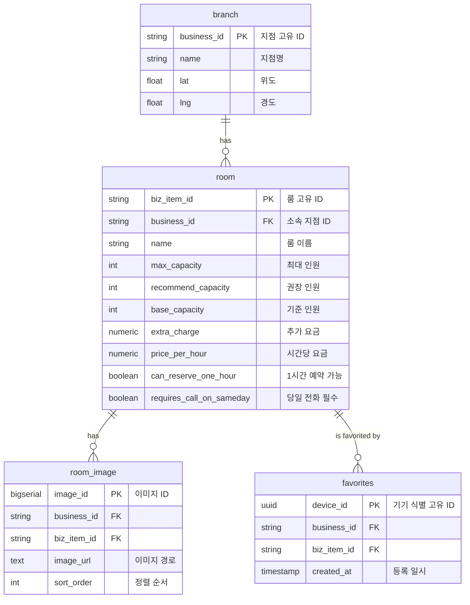

# Pick Habju Backend (픽합주 백엔드)


**합주실 예약 가능 여부 확인 서비스**  
사용자가 원하는 합주실의 실시간 예약 가능 여부를 확인하고, 네이버 예약 시스템 연동을 통해 편리한 예약 경험을 제공하는 백엔드 API 서버입니다.

## 📝 프로젝트 배경 (Project Background)

합주실 예약 시 플랫폼마다 흩어져 있는 예약 정보를 확인하기 번거롭다는 문제를 해결하기 위해 시작되었습니다. 본 프로젝트는 다양한 합주실 예약 정보를 통합하여 실시간으로 제공함으로써 사용자의 탐색 비용을 줄이는 것을 목표로 합니다.

## ✨ Key Features (주요 기능)

- [x] **실시간 예약 가능 여부 조회**: 네이버 예약 시스템 연동을 통한 지점별/룸별 실시간 현황 제공
- [x] **지도 기반 합주실 탐색**: 사용자 주변 및 특정 지역의 합주실 위치와 정보를 지도상에서 한 눈에 확인
- [x] **개인화된 즐겨찾기**: 별도의 로그인 없이 기기 기반(Device ID)으로 자주 가는 합주실을 저장하고 관리

## 🚀 Engineering Highlights (기술적 강점)

- **확장성 높은 크롤링 엔진**: `Crawler Registry` 패턴을 사용하여 새로운 예약 플랫폼 연동 시 기존 로직 수정 없이 동적으로 기능 확장 가능
- **표준화된 API 응답 구조**: `Envelope Pattern`을 전역 적용하여 프론트엔드와의 통신 규약을 단일화하고 연동 생산성 극대화
- **비동기 병렬 데이터 수집**: `FastAPI`와 `httpx` 비동기 통신을 활용하여 다수 합주실의 데이터를 지연 없이 실시간 수집 및 가공
- **객체 지향적 계층 구조**: `Service Layer`와 `Repository Pattern`을 적용하여 비즈니스 로직의 응집도를 높이고 테스트 용이성 확보
- **자동화된 문서화**: `Swagger UI`를 통한 실시간 API 명세 제공으로 개발 가독성 및 원활한 팀 협업 유도

## 🛠️ 기술 스택 (Tech Stack)

| Category | Technology | Description |
| --- | --- | --- |
| **Language** | Python 3.12+ | 최신 Python 문법 및 타입 힌트 활용 |
| **Framework** | FastAPI | 고성능 비동기 웹 프레임워크 |
| **Database** | Supabase (PostgreSQL) | 합주실 메타 데이터 및 즐겨찾기 관리 |
| **Crawling** | Playwright / GraphQL / HTTPX | 네이버 지도/예약 크롤링 & 고성능 HTTP 클라이언트 |
| **AI / LLM** | Google Gemini / Ollama | (선택) 데이터 분석 및 로컬/클라우드 LLM 활용 |
| **Security** | SlowAPI | API Rate Limiting (요청 제한) |
| **Testing** | Pytest | 단위 테스트 및 통합 테스트 프레임워크 |
| **VCS** | Git / GitHub | 버전 관리 및 협업 |

---

### 📂 디렉토리 구조 및 모듈별 책임 (Module Responsibilities)

프로젝트는 관심사 분리를 위해 각 모듈의 책임을 엄격히 제한합니다. 새로운 기능을 추가할 때는 아래의 분류 기준을 따릅니다.

| Module | Responsibility (책임 및 역할) |
| :--- | :--- |
| **api/** | **Interface**: 요청을 수신하고 최종 응답을 반환. 비즈니스 로직은 Service 계층에 위임합니다. |
| **services/** | **Business Logic**: 여러 크롤러나 레포지토리를 조합하여 애플리케이션의 핵심 기능을 수행합니다. |
| **crawler/** | **External Data**: 외부 예약 플랫폼 연동을 담당합니다. `BaseCrawler`를 통해 일관된 인터페이스를 유지합니다. |
| **repositories/** | **Data Access**: 데이터베이스(Supabase)에 직접 접근하여 순수한 CRUD 작업을 수행합니다. |
| **models/** | **Data Transfer (DTO)**: 계층 간 데이터 이동을 위한 데이터 모델을 정의하고 `@field_validator`로 유효성을 검증합니다. |
| **core/** | **Infrastructure**: 환경 설정, 전역 예외 처리, 공통 응답 포맷 등 시스템 전반의 설정을 관리합니다. |
| **utils/** | **Utilities**: 특정 도메인에 종속되지 않는 공통 기능(HTTP 클라이언트, 로더 등)을 제공합니다. |

---

### 🛠️ 주요 모듈 활용 및 확장 가이드 (How to Extend)

#### (1) 새로운 예약 플랫폼(크롤러) 추가하기
본 프로젝트는 **Crawler Registry** 패턴을 사용하여 새로운 플랫폼을 아주 쉽게 추가할 수 있습니다.
1. `app/crawler/base.py`의 `BaseCrawler`를 상속받는 새로운 클래스 파일을 생성합니다.
2. `check_availability` 추상 메서드를 플랫폼의 특성에 맞게 구현합니다.
3. 파일 하단에서 `registry.register("플랫폼명", NewCrawler())`를 호출하여 등록합니다.
4. 이제 `AvailabilityService`가 자동으로 새 플랫폼을 인식하여 예약 조회를 수행합니다.

#### (2) 공용 에러 핸들링 사용하기
새로운 비즈니스 예외가 필요할 경우:
1. `app/exception/base_exception.py`를 상속받아 커스텀 예외 클래스를 만듭니다.
2. `app/core/error_codes.py`에 고유한 에러 코드를 추가합니다.
3. 로직 내에서 예외를 `raise`하면 `app/exception/envelope_handlers.py`가 자동으로 이를 감지하여 표준 Envelope 응답으로 변환합니다.

---

---

## 🏗️ 전체 시스템 및 인프라 아키텍처 (Infrastructure Architecture)

### 📐 가용성 및 보안 아키텍처
```
┌──────────────┐     ┌──────────────┐     ┌──────────────┐     ┌──────────────┐
│   클라이언트    │ ──▶ │  Cloudflare  │ ──▶ │  Cloud Run   │ ──▶ │   Supabase   │
│   (앱/웹)     │     │  (CDN/WAF)   │     │  (API 서버)   │     │  (PostgreSQL)│
└──────────────┘     └──────────────┘     └──────────────┘     └──────────────┘
```

### ☁️ Google Cloud Platform (GCP)

| 서비스 | 용도 |
| :--- | :--- |
| **Cloud Run** | 컨테이너화된 API 서버를 서버리스 환경에서 실행 |
| **Artifact Registry** | Docker 이미지 빌드 및 저장소 관리 |
| **Cloud Logging** | 실시간 로그 수집 및 모니터링 |

- **CI/CD 프로세스**: `GitHub Actions` → `Docker Build` → `Artifact Registry` → `Cloud Run` 자동 배포
- **인증**: **Workload Identity Federation (WIF)**를 통한 안전한 GCP 리소스 접근

### 🔶 Cloudflare (Security & Network)

| 기능 | 설명 |
| :--- | :--- |
| **SSL/TLS** | HTTPS 인증서 자동 관리 및 Full (Strict) 모드 적용 |
| **WAF** | 웹 애플리케이션 방화벽을 통한 악의적 트래픽 차단 |
| **Rate Limit** | 특정 구간(예: 검색/로그인)의 무차별 대입 및 DDoS 방어 |
| **CDN/DNS** | API 도메인 라우팅 및 정적 리소스 최적화 |

### 🗄️ Supabase (Database Layer)

| 환경 | 용도 및 구성 |
| :--- | :--- |
| **Prod** | 실제 운영용 PostgreSQL 데이터베이스 |
| **Alpha** | `dev` 브랜치 연동 실시간 개발/테스트용 환경 |

---

## 🔄 CI/CD 파이프라인 (CI/CD Pipeline)

GitHub Actions를 통해 코드 품질 검증 및 자동 배포가 수행됩니다.

```
┌───────────────────────────────────────────────────────────────────┐
│                        GitHub Actions                             │
├───────────────────────────────────────────────────────────────────┤
│  1. 코드 체크아웃 및 테스트(Pytest) 실행                               │
│  2. WIF로 GCP 인증                                                 │
│  3. Docker 이미지 빌드 및 Artifact Registry 푸시                     │
│  4. (Prod) Supabase DB 백업 및 마이그레이션 적용                     │
│  5. Cloud Run 서비스 배포 및 Discord 알림 전송                        │
└───────────────────────────────────────────────────────────────────┘
```

| 워크플로우 파일 | 실시간 브랜치 | 대상 배포 환경 |
| :--- | :--- | :--- |
| `deploy-test.yaml` | `dev` | Alpha API 서비스 |
| `deploy-prod.yaml` | `main` | Prod API 서비스 |

---

## 📡 주요 API 엔드포인트 (Key API Endpoints)

| Endpoint | Method | Description |
|----------|--------|-------------|
| `/api/rooms/availability` | `GET` | 지도 기반 합주실 및 예약 가능 여부 조회 |
| `/api/favorites` | `GET` | 사용자의 즐겨찾기 목록 조회 |
| `/api/favorites` | `POST` | 특정 합주실을 즐겨찾기에 추가 |
| `/api/favorites` | `DELETE` | 즐겨찾기 항목 삭제 |

> 상세한 API 명세는 서버 실행 후 [Swagger UI](http://127.0.0.1:8000/docs)에서 확인할 수 있습니다.

---

## 🚀 시작 가이드 (Getting Started)

로컬 개발 환경을 설정하고 서버를 실행하는 방법입니다.

### 1-1. 프로젝트 클론
```bash
git clone https://github.com/summitBandWeb/pick-habju-backend.git
cd pick-habju-backend
```

### 1-2. 가상환경 생성 및 활성화

**Windows (PowerShell)**
```powershell
# 가상환경 생성 (venv 대신 다른 이름 사용 시 .gitignore에 추가 필요)
python -m venv venv

# 가상환경 활성화(venv는 가상환경 이름)
.\venv\Scripts\Activate.ps1
```

**Mac/Linux**
```bash
# 가상환경 생성
python3 -m venv venv

# 가상환경 활성화
source venv/bin/activate
```

### 2. 패키지 설치
**가상환경 활성화 후** `requirements.txt`에 명시된 필수 라이브러리를 설치합니다.

```bash
pip install -r requirements.txt
```

### 3. Playwright 브라우저 설치
네이버 지도 크롤링을 위해 Playwright 브라우저 바이너리를 설치해야 합니다.

```bash
playwright install chromium
```

### 4. 환경 변수 설정
프로젝트 루트의 `.env.example` 파일을 복사하여 `.env` 파일을 생성하고, 필요한 값을 설정합니다.
(**구체적인 환경변수 값은 팀 노션 페이지를 참고하세요.**)

```bash
cp .env.example .env
```

```ini
# .env 예시
ENV=dev
SUPABASE_URL=your_supabase_url
SUPABASE_KEY=your_supabase_key
NAVER_MAP_URL=https://map.naver.com
```

### 5. 서버 실행

```bash
# 개발 모드 (코드 수정 시 자동 재시작)
uvicorn app.main:app --reload
```

서버가 실행되면 아래 주소에서 API 문서를 확인할 수 있습니다.
- Swagger UI: [http://127.0.0.1:8000/docs](http://127.0.0.1:8000/docs)
- ReDoc: [http://127.0.0.1:8000/redoc](http://127.0.0.1:8000/redoc)

---

## 🧪 테스트 실행

`pytest`를 사용하여 작성된 테스트 코드를 실행할 수 있습니다.

```bash
# 전체 테스트 실행
pytest

# 특정 파일 테스트 실행
pytest tests/api/test_available_room.py
```

---

## 🛠️ 트러블슈팅 (Troubleshooting)

### 1. Playwright 실행 오류
- **현상**: 크롤링 작업 시 브라우저 바이너리 부족 에러 발생
- **해결**: `playwright install chromium` 명령어를 통해 필수 브라우저를 설치하세요.

### 2. Supabase 연결 오류
- **현상**: 데이터 조회 시 `APIError` 또는 연결 타임아웃 발생
- **해결**: `.env` 파일의 `SUPABASE_URL`과 `SUPABASE_KEY`가 정확한지 확인하고, 로컬 네트워크 환경(방화벽 등)을 점검하세요.

---

## 🤝 기여 가이드 (Contribution Guide)

1. **이슈 생성**: 새로운 기능 개발이나 버그 수정 시작 전, 이슈를 생성하여 의도를 공유합니다.
2. **브랜치 생성**: 규칙에 맞는 브랜치를 생성합니다 (예: `feat/130-description`).
3. **코드 작성 및 테스트**: 기능을 구현하고 적절한 테스트 코드를 작성합니다.
4. **Pull Request**: 작업 완료 후 PR을 생성하며, 팀원 1명 이상의 승인이 필요합니다.
5. **커밋 메시지**: 팀 노션 업무 스페이스의 컨벤션을 엄격히 준수합니다.

---

- **Commit Message**: [Conventional Commits](https://www.conventionalcommits.org/) 규칙을 따릅니다. 자세한 내용은 팀 노션 업무 스페이스를 참고하세요.
- **Branch Strategy**: Git Flow 변형 (main, dev, feat/*)


## 🗄️ 데이터베이스 구조 (Database Schema)

Supabase (PostgreSQL)를 사용하여 합주실 데이터와 사용자 즐겨찾기 정보를 관리합니다.



### 주요 테이블 설명

| Table | Description | Key Columns |
| --- | --- | --- |
| `branch` | 합주실 지점 정보 (예: XX합주실 홍대점) | `business_id` (PK), `name`, `lat`, `lng` |
| `room` | 지점 내 개별 룸 정보 (예: A룸, B룸) | `biz_item_id` (PK), `business_id` (FK), `price_per_hour`, `max_capacity` |
| `favorites` | 사용자 즐겨찾기 목록 | `device_id` (UUID), `biz_item_id` (FK), `created_at` |

- **관계 (Relationships)**:
    - `branch` (1) : `room` (N) -> 하나의 지점은 여러 개의 룸을 가집니다.
    - `room` (1) : `favorites` (N) -> 하나의 룸은 여러 사용자에 의해 즐겨찾기 될 수 있습니다. 
    - (참고: `favorites`는 `device_id`를 통해 비로그인 사용자도 기기 기반으로 식별합니다.)
